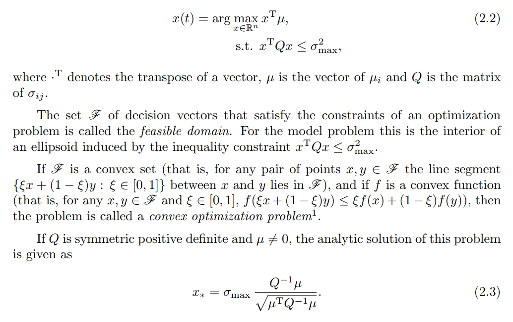

# Intermezzo: Risk vs. Cash

## Univariate Trading systems

$$\mathrm{Cash\;Position} = G \times \mu \oslash \mathrm{Volatility}$$

Here $\oslash$ denotes the element-wise division of two vectors of the same length.
The vector $\mu$ is a prediction for the volatility adjusted return.
The constant $G$ is a scaling factor.

* Hedge funds embrace the construction of powerful $\mu$. Quant Researchers, Traders
* Less effort is put into constructing a good measure for Volatility
  (often based on high-frequency data). Volatility shouldn't be too nervous but
  nevertheless respond fast.
* Combination of many such individual systems often considered to be a pure IT
  problem. Risk Managers or Committee.

## Risk vs. Cash

* Asset allocation can be done both in **risk** or in **cash** space. Both approaches
  are equivalent.
* The risk (variance) of the portfolio is

$$
c^T\,\mathbf{Cov}\,c
= (c \odot \mathrm{Volatility})^T \mathbf{Cor}\,( \mathrm{Volatility} \odot c)
= x^T \mathbf{Cor}\,x
$$

* The condition number for $\mathbf{Cor}$ is lower than the condition number
  for $\mathbf{Cov}$.
* The entries of $x$ will spread less than the entries in $c$.
* The entries of $x$ bear more insight than the entries of $c$.

## Expected return

$$
(c \odot \mathrm{Volatility})^T \mu = x^T \mu
$$

## Risk

$$
x^T \mathbf{Cor}\,x
$$

## Optimization

Hence we solve for the risk position the Markowitz problem

$$
\arg\max_{x\in\mathbb{R}^n}\,x^T \mu
$$

such that

$$
x^T \mathbf{Cor}\,x \leq \sigma^2_{\mathrm{max}}.
$$

The solution $x^*$ is the optimal risk position. The analytic solution for $x^*$
is given by

$$
x^* = \sigma_{\mathrm{max}} \frac{\mathbf{Cor}^{-1} \mu}{\sqrt{\mu^T\,\mathbf{Cor}^{-1}\,\mu}}
$$

Note that the term in the denominator $\sqrt{\mu^T\,\mathbf{Cor}^{-1}\,\mu}$
induces a norm (often called the $A$-norm).

If we assume there are no cross-correlations the correlation matrix boils down
to the identity and we get:

$$
x^* = \sigma_{\mathrm{max}}\,{\mu}\, /\, \lVert   \mu \rVert_2
$$

The cash position $c^∗=x^* \oslash \mathrm{Volatility}$  is here a scaled version
of the original univariate problem.

Note that it would be insane to use the sample correlation matrix.
It is important to modify the spectrum of the observed correlation matrices.

Study in particular Sin 1 and Sin 2 from
<https://arxiv.org/pdf/1310.3396.pdf>

## Conclusions

* We interpret $\frac{\mu}{\mathrm{volatility}}$ as the (unscaled) solution
  of a convex program.
* The univariate trading system is now a special case of much richer class
  of multivariate trading systems.
* We work in the space of risk rather than cash positions.
